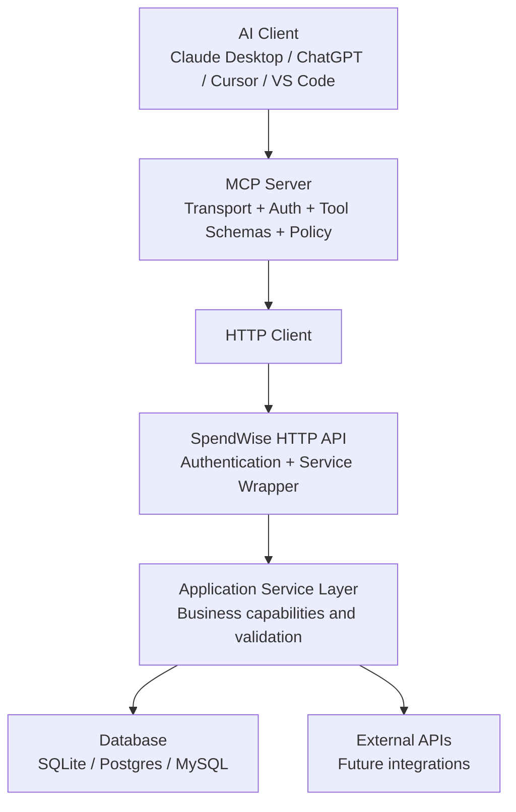
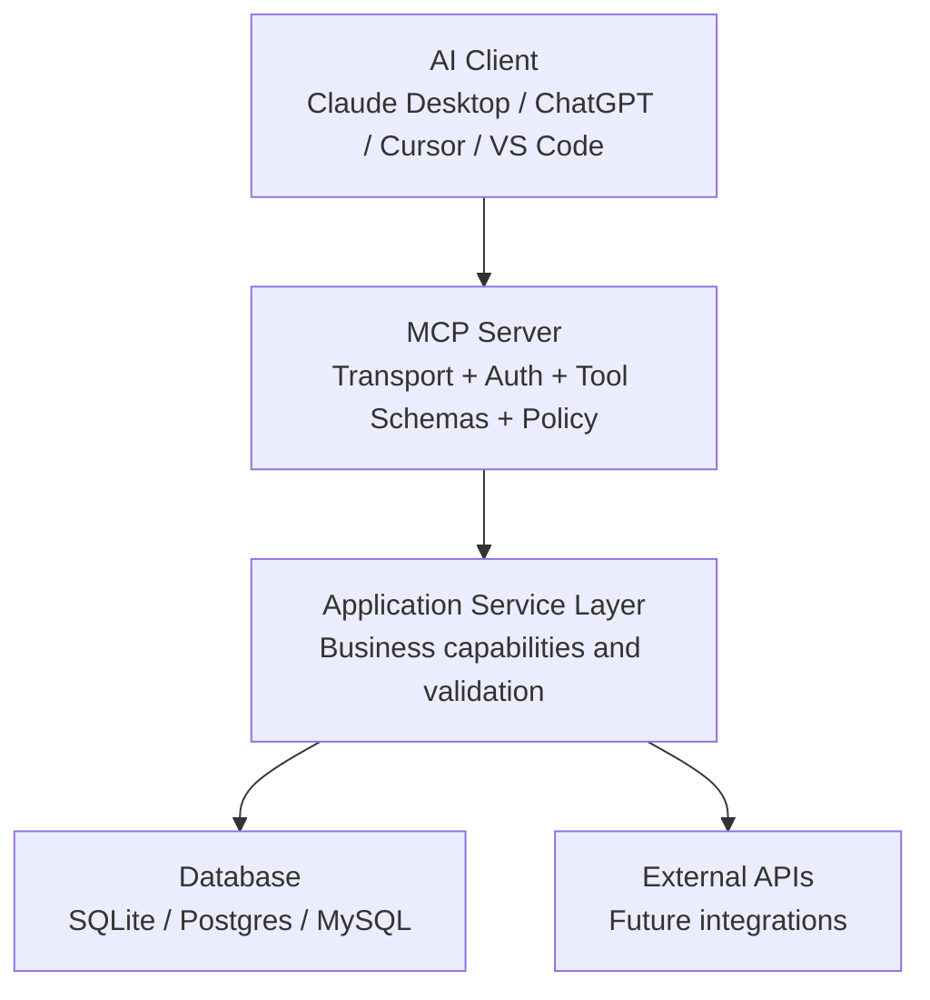
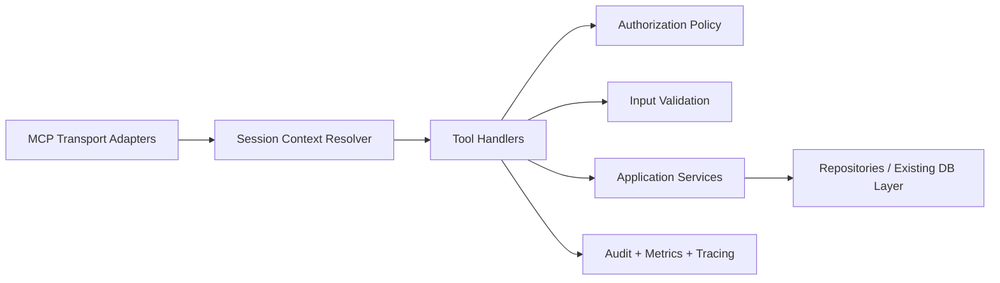

# SpendWise MCP Design & Architecture Document

## Assumptions And Open Questions

This document is based on the current backend codebase, which exposes these business areas through the service layer:

- financial records
- categories
- budgets and budget progress
- savings goals and goal progress
- financial summaries
- CSV and JSON imports
- CSV export
- balance recalculation and summary regeneration

Assumptions used in this design:

- The MCP server will be a new integration layer on top of the existing application service layer, not a replacement for the HTTP API.
- MCP tools will call service-layer business operations, never the ORM or database directly.
- The production MCP deployment must support authenticated end users, even though the current backend has no user model or tenant boundary yet.
- AI assistants should act on behalf of a specific user or workspace, not as a global superuser.
- Financial data is sensitive and must be treated as confidential by default.
- Existing service behavior around recalculating balances and regenerating summaries after record mutations remains the system of record.

Open questions that should be resolved before implementation:

- What is the canonical identity provider: application-issued JWT, Supabase/Auth0/Clerk, API gateway identity, or something else?
- Will SpendWise remain single-user per deployment, or is multi-user or multi-tenant support required?
- Should the MCP server support human approval for all writes, only destructive writes, or only high-risk financial actions?
- Should CSV/JSON import remain available to AI clients in production, or be admin-only due to blast radius?
- Is record deletion intended to remain hard delete, or should MCP introduce soft delete first?
- Is there a business requirement for attachment/file support beyond the current CSV import/export?
- Are there rate limits, usage quotas, or subscription-tier differences that should affect tool availability?

Until those questions are resolved, this design recommends a conservative security model and assumes future multi-user support.

## 1. Overview

### Purpose Of The MCP Server

The SpendWise MCP server will expose high-value financial application capabilities to AI assistants through a secure, capability-oriented interface. Its purpose is to let assistants help users understand spending, analyze trends, organize categories, manage budgets, track goals, and perform carefully controlled financial operations without exposing internal persistence details.

### Intended AI Clients

The server should be compatible with MCP-capable clients including:

- Claude Desktop
- ChatGPT MCP clients and agent runtimes
- Cursor
- VS Code MCP integrations
- internal orchestration agents and automation runners

### Scope

In scope:

- read-only financial discovery and analytics
- limited, explicit financial mutations through business-safe tools
- import and export workflows if explicitly authorized
- operational visibility for the MCP service itself
- a transport-agnostic business capability layer that can be reused outside MCP

### Non-Goals

Out of scope:

- exposing raw database tables, SQL, or ORM models
- generic CRUD mirroring of every HTTP endpoint
- letting AI choose arbitrary columns, joins, or queries
- bypassing application validation or business rules
- direct filesystem or secret access through MCP tools
- unrestricted admin capabilities for general end-user AI sessions

## 2. Design Philosophy

The MCP server should follow these principles.

### Capabilities Over CRUD

Tools should represent meaningful user outcomes such as "analyze monthly spending", "set a category budget", or "add progress to a savings goal", not generic create, read, update, delete primitives.

### Business Actions Instead Of Database Operations

The MCP layer must speak the language of records, budgets, goals, categories, summaries, imports, and exports. It must never expose tables, foreign keys, joins, or update statements.

### Read-First Design

Assistants should be able to inspect records, categories, summaries, and budgets before making changes. Read tools should be richer and safer than write tools.

### Least Privilege

Every session should receive the minimum tool set and data scope necessary. Read-only assistants should not receive mutation tools. Administrative tools should be isolated.

### Explicit Mutations

All write tools must require deliberate invocation with well-defined inputs. Mutations should never be inferred from vague prompts.

### Stateless Tools Where Possible

Each tool call should carry enough context to execute safely without relying on hidden session memory. Any stateful workflow should be explicit and auditable.

### Idempotent Operations

Where retries are plausible, write operations should accept idempotency keys or an equivalent request fingerprint to prevent duplicate records, duplicate imports, or duplicated goal progress.

### Validation-First Architecture

All inputs must be validated server-side before service execution. The MCP server should reject malformed, ambiguous, or unsafe requests before they reach business logic.

## 3. High-Level Architecture

### Current Deployment (HTTP API Integration)



The current MCP server integrates with SpendWise by calling its HTTP REST API. The MCP server acts as an HTTP client, translating tool calls into backend HTTP requests. Authentication and user/workspace ownership context must be enforced at the HTTP API boundary.

### Alternative Deployment (Direct Application-Service Integration)

In an alternative deployment, the MCP server may link directly to the application service layer within the same process, bypassing the HTTP boundary:



If deployed this way, the MCP server must enforce authentication and user/workspace ownership context directly, as there is no intermediate HTTP API layer to perform these checks.

### Layer Responsibilities

#### AI Client

- presents tools to the model
- passes authenticated session context
- may request confirmation before mutation
- should not contain business logic

#### MCP Server

- implements MCP transport and tool registration
- authenticates callers and resolves user/workspace context
- authorizes tool usage
- validates input schemas
- normalizes requests into application commands
- enforces safety rules such as confirmation and idempotency
- shapes outputs for AI consumption
- logs, meters, and audits every invocation

#### HTTP API Boundary (current deployment only)

- authenticates end-user credentials
- enforces user/workspace ownership isolation
- wraps application service layer with HTTP transport
- provides authentication context to service layer

#### Application Service Layer

- owns business logic
- performs domain validation beyond schema checks
- executes transactions
- recalculates balances and summaries where required
- resolves categories and domain references
- remains reusable from HTTP, MCP, CLI, jobs, or tests

#### Database / External APIs

- stores the authoritative financial state
- supports transactional integrity
- should never be directly exposed to MCP clients
- future external providers must be wrapped behind service abstractions

### Internal Architecture Recommendation



Tradeoff:

- Keeping MCP tool handlers thin reduces duplicated business logic and makes the MCP surface safer to evolve.
- Adding a dedicated authorization and policy layer is extra work now, but necessary for production multi-user use.

## 4. Authentication & Authorization

### User Authentication

Preferred model:

- The AI client authenticates to the MCP server using a bearer token or signed session credential.
- The MCP server validates the token and resolves a user identity, tenant or workspace, and permission set.
- Anonymous access should be disabled in production.

### Service Authentication

If the MCP server calls the existing HTTP API instead of linking the service layer directly:

- use a service-to-service credential separate from end-user tokens
- forward user identity as signed claims or trusted headers only through a secure internal channel
- never let the AI client provide privileged service credentials

If the MCP server is in-process with the application:

- use the authenticated session context directly
- avoid creating a second trust boundary inside the same process

### User Context Propagation

Every tool invocation should include internally:

- `user_id`
- `tenant_id` or `workspace_id` if applicable
- session or conversation ID
- client application identity
- permission scopes

This context must flow into the service layer, logging, and audit records.

### Multi-User Considerations

The current backend appears single-database and not user-scoped. For MCP production use, add a user or tenant boundary before enabling broad deployment. Without that, the MCP server risks exposing one user’s financial data to another.

Recommended direction:

- add `owner_id` or `workspace_id` to business entities
- enforce row-level filters in the service or repository layer
- make ownership mandatory in all read and write service methods

### Permission Model

Recommended scopes:

- `records.read`
- `records.write`
- `categories.read`
- `categories.write`
- `budgets.read`
- `budgets.write`
- `goals.read`
- `goals.write`
- `analytics.read`
- `import.write`
- `export.read`
- `maintenance.write`
- `admin.read`
- `admin.write`

### Tool-Level Authorization

Every tool should declare required scopes. Authorization must happen before input execution. Some tools should also enforce contextual checks, for example:

- record modifications only within the caller’s workspace
- import tools only for trusted roles
- maintenance tools only for operators or administrators

## 5. Tool Design Guidelines

### Naming Conventions

Use verb-first, capability-based names:

- `search_records`
- `get_financial_summary`
- `get_budget_progress`
- `create_spending_record`
- `add_goal_progress`

Avoid:

- `get_records_table`
- `update_row`
- `run_sql`
- `create_budget_object`

### Input Schemas

Each tool should have:

- explicit required fields
- strict enums where applicable
- bounded string lengths
- normalized date formats
- optional pagination for list-like results
- optional idempotency key for mutating operations

Prefer specific fields over free-form payload blobs.

### Output Schemas

Outputs should be stable, compact, and AI-friendly:

- clear top-level object names
- machine-readable identifiers
- human-readable summaries where useful
- pagination metadata when returning collections
- warning arrays when partial behavior occurs

Do not expose internal DB metadata, SQL errors, or ORM-specific details.

### Validation

Validation should occur in layers:

1. MCP schema validation
2. transport normalization
3. domain validation in the service layer
4. persistence constraints in the database

Existing backend validation already covers dates, names, amounts, colors, goal status, and IDs. The MCP layer should reuse and extend that, not replace it.

### Error Handling

Return structured errors with consistent types, messages, and optional details. Validation and business-rule errors should be actionable for the model.

### Idempotency

Mutating tools should support one of:

- caller-provided `idempotency_key` scoped to the authenticated actor/tenant AND tool
- deterministic deduplication fingerprint for known-safe operations
- explicit duplicate detection rules

The implementation must persist the normalized request and result for the retention period (recommended: at least 24 hours). Reusing an idempotency key with a different normalized request must return a conflict error.

### Pagination

Required for tools that can return many records. Include:

- `page`
- `limit`
- `total_count`
- `total_pages`
- `has_next`
- `has_prev`

### Filtering

Filters should be explicit and constrained. Good examples for this app:

- date range
- record type
- category name or category ID
- amount range
- search term
- group by category or month

### Confirmation Flows

Require confirmation for:

- deleting records, categories, budgets, or goals
- imports
- exports containing sensitive data if the client supports gated file delivery
- maintenance actions like full balance refresh or summary regeneration

### What Should Not Become A Tool

Do not expose:

- raw SQL execution
- generic table browsing
- unrestricted CRUD on every model
- direct summary-table rewrites
- category foreign key manipulation
- internal health internals that reveal secrets or infrastructure details
- low-level migration, database, or filesystem operations

## 6. Tool Categories

Logical groups for SpendWise:

### Search

- record discovery with filters
- grouped spending lookups

### Analytics

- financial summary retrieval
- budget progress analysis
- goal progress visibility

### Read Operations

- list categories
- get a record
- list budgets
- list goals

### Write Operations

- create a spending or income record
- update a record
- create or update a budget
- create or update a goal
- add goal progress
- manage categories cautiously

### Administrative Operations

- import data
- export data
- recalculate balances
- regenerate summaries

### AI Helper Utilities

Only add these if they map to true business value, for example:

- normalize category name suggestions
- explain budget overrun drivers

These should be derived capabilities, not thin wrappers around internal data.

## 7. Proposed MCP Tools

The proposed tools below are intentionally capability-oriented and conservative. Some existing HTTP actions are intentionally not exposed or are narrowed for safer MCP use.

### 7.1 `search_records`

- Description: Search financial records with filtering, pagination, and optional grouping.
- When it should be used: Before any record analysis, review, correction, or deletion; for spending investigation; for reporting.
- Parameters:
  - `from_date` optional, `YYYY-MM-DD`
  - `to_date` optional, `YYYY-MM-DD`
  - `category` optional
  - `record_type` optional enum: `income`, `expense`, `transfer`
  - `min_amount` optional positive number
  - `max_amount` optional positive number
  - `search` optional text
  - `group_by` optional enum: `category`, `month`
  - `page` optional, default `1`
  - `limit` optional, bounded default `25`, max recommended `100`
- Validation:
  - valid date range
  - `min_amount <= max_amount`
  - valid enum values
  - bounded page and limit
- Permissions: `records.read`
- Expected output:
  - paginated `records` collection, or `groups` when grouped
  - pagination metadata for non-grouped results
- Possible errors:
  - `validation_error`
  - `forbidden`
  - `internal_error`
- Confirmation required: No
- Read-only or mutating: Read-only

### 7.2 `get_record_details`

- Description: Retrieve one record by ID.
- When it should be used: After search results identify the exact record to inspect or modify.
- Parameters:
  - `record_id` required
- Validation:
  - non-empty ID
  - ownership check
- Permissions: `records.read`
- Expected output:
  - full record details
- Possible errors:
  - `validation_error`
  - `not_found`
  - `forbidden`
- Confirmation required: No
- Read-only or mutating: Read-only

### 7.3 `get_financial_summary`

- Description: Return income, expense, net, opening balance, closing balance, and category breakdown for a time range.
- When it should be used: For financial review, planning, or answering user questions about performance.
- Parameters:
  - `from_date` required
  - `to_date` required
  - `category` optional
  - `record_type` optional enum: `income`, `expense`
- Validation:
  - valid dates
  - `from_date <= to_date`
  - range-size limit if needed for performance
- Permissions: `analytics.read`
- Expected output:
  - summary object with totals and categorized breakdown
- Possible errors:
  - `validation_error`
  - `forbidden`
  - `internal_error`
- Confirmation required: No
- Read-only or mutating: Read-only

### 7.4 `list_categories`

- Description: Return available categories for classification and planning.
- When it should be used: Before creating records, budgets, or goals tied to categories.
- Parameters:
  - none initially
- Validation:
  - caller context only
- Permissions: `categories.read`
- Expected output:
  - ordered category list with ID, name, icon, color
- Possible errors:
  - `forbidden`
  - `internal_error`
- Confirmation required: No
- Read-only or mutating: Read-only

### 7.5 `list_budgets`

- Description: Retrieve budgets for a specific month and year.
- When it should be used: Budget inspection, planning, or before updating a budget.
- Parameters:
  - `month` required, `1-12`
  - `year` required
- Validation:
  - valid month and year bounds
- Permissions: `budgets.read`
- Expected output:
  - budget list with category names
- Possible errors:
  - `validation_error`
  - `forbidden`
  - `internal_error`
- Confirmation required: No
- Read-only or mutating: Read-only

### 7.6 `get_budget_progress`

- Description: Return budgets plus spent amount and percentage for a given month.
- When it should be used: To answer questions like which categories are over budget.
- Parameters:
  - `month` required
  - `year` required
- Validation:
  - valid month and year
- Permissions: `budgets.read`, `analytics.read`
- Expected output:
  - per-category budget progress including percentage consumed
- Possible errors:
  - `validation_error`
  - `forbidden`
  - `internal_error`
- Confirmation required: No
- Read-only or mutating: Read-only

### 7.7 `list_goals`

- Description: Return savings and financial goals with status and progress.
- When it should be used: Goal reviews, planning help, and before goal updates.
- Parameters:
  - optional `status` filter in a future version
- Validation:
  - valid enum if filter added
- Permissions: `goals.read`
- Expected output:
  - list of goals with current amount, target amount, status, target date, category
- Possible errors:
  - `forbidden`
  - `internal_error`
- Confirmation required: No
- Read-only or mutating: Read-only

### 7.8 `get_goal_details`

- Description: Retrieve one goal by ID.
- When it should be used: Before updating, deleting, or adding progress.
- Parameters:
  - `goal_id` required
- Validation:
  - non-empty ID
- Permissions: `goals.read`
- Expected output:
  - goal object
- Possible errors:
  - `validation_error`
  - `not_found`
  - `forbidden`
- Confirmation required: No
- Read-only or mutating: Read-only

### 7.9 `create_spending_record`

- Description: Create a new financial record.
- When it should be used: When the user explicitly wants to log an expense, income, or transfer.
- Parameters:
  - `date` required
  - `description` optional but recommended
  - `category` required
  - `amount` required positive number
  - `record_type` required enum: `income`, `expense`, `transfer`
  - `note` optional
  - `idempotency_key` recommended
- Validation:
  - valid date
  - positive amount
  - category must exist
  - valid type
  - field length bounds
- Permissions: `records.write`
- Expected output:
  - created record ID and normalized echo of stored values
- Possible errors:
  - `validation_error`
  - `invalid_input` for unknown category
  - `conflict` for duplicate idempotent request
  - `forbidden`
  - `internal_error`
- Confirmation required: Optional client-side confirmation; required if the client session is in safe mode
- Read-only or mutating: Mutating

### 7.10 `update_spending_record`

- Description: Apply a partial update to an existing record.
- When it should be used: Correcting a category, amount, date, note, or description.
- Parameters:
  - `record_id` required
  - one or more of `date`, `description`, `category`, `amount`, `record_type`, `note`
  - `version` or `updated_at` token recommended for optimistic locking
  - `idempotency_key` recommended
- Validation:
  - at least one mutable field present
  - existing category if category changed
  - optimistic lock check if enabled
- Permissions: `records.write`
- Expected output:
  - updated record ID and fields changed
- Possible errors:
  - `validation_error`
  - `not_found`
  - `invalid_input`
  - `conflict` for stale version
  - `forbidden`
- Confirmation required: No for non-destructive corrections
- Read-only or mutating: Mutating

### 7.11 `delete_spending_record`

- Description: Delete a record by ID.
- When it should be used: Only when the user explicitly requests record removal.
- Parameters:
  - `record_id` required
  - `confirmation_token` required
  - `reason` optional but recommended for audit
  - `idempotency_key` recommended
- Validation:
  - non-empty ID
  - valid confirmation token
  - ownership check
- Permissions: `records.write`
- Expected output:
  - deleted record ID and audit reference
- Possible errors:
  - `validation_error`
  - `not_found`
  - `forbidden`
  - `conflict`
- Confirmation required: Yes
- Read-only or mutating: Mutating

### 7.12 `create_budget`

- Description: Set a category budget for a month.
- When it should be used: When the user explicitly wants to create a spending cap for a category and period.
- Parameters:
  - `category_id` required
  - `month` required
  - `year` required
  - `amount` required positive number
  - `idempotency_key` recommended
- Validation:
  - valid category
  - month and year valid
  - amount positive
  - uniqueness per category-month-year
- Permissions: `budgets.write`
- Expected output:
  - budget ID and stored budget data
- Possible errors:
  - `validation_error`
  - `conflict` if budget already exists
  - `forbidden`
  - `internal_error`
- Confirmation required: No
- Read-only or mutating: Mutating

### 7.13 `update_budget`

- Description: Change a budget amount.
- When it should be used: When the user wants to revise a monthly budget.
- Parameters:
  - `budget_id` required
  - `amount` required positive number
  - `version` optional but recommended
  - `idempotency_key` recommended
- Validation:
  - positive amount
  - budget exists
- Permissions: `budgets.write`
- Expected output:
  - updated budget ID and amount
- Possible errors:
  - `validation_error`
  - `not_found`
  - `conflict`
  - `forbidden`
- Confirmation required: No
- Read-only or mutating: Mutating

### 7.14 `delete_budget`

- Description: Remove a budget.
- When it should be used: Only after confirming the user wants the budget removed.
- Parameters:
  - `budget_id` required
  - `confirmation_token` required
  - `idempotency_key` recommended
- Validation:
  - valid ID
  - confirmation token
- Permissions: `budgets.write`
- Expected output:
  - deleted budget ID
- Possible errors:
  - `validation_error`
  - `not_found`
  - `forbidden`
- Confirmation required: Yes
- Read-only or mutating: Mutating

### 7.15 `create_goal`

- Description: Create a financial goal.
- When it should be used: When the user wants to track a savings target or planned financial milestone.
- Parameters:
  - `name` required
  - `target_amount` required positive number
  - `target_date` optional
  - `category` optional
  - `description` optional
  - `monthly_contribution` optional non-negative number
  - `idempotency_key` recommended
- Validation:
  - target amount positive
  - target date format
  - category exists if provided
  - name and description length bounds
- Permissions: `goals.write`
- Expected output:
  - created goal ID and stored goal data
- Possible errors:
  - `validation_error`
  - `invalid_input`
  - `forbidden`
  - `internal_error`
- Confirmation required: No
- Read-only or mutating: Mutating

### 7.16 `update_goal`

- Description: Update goal metadata or status.
- When it should be used: For revising targets, status, dates, category, or contribution plans.
- Parameters:
  - `goal_id` required
  - one or more goal fields
  - `version` optional but recommended
  - `idempotency_key` recommended
- Validation:
  - at least one field present
  - valid status enum
  - non-negative current amount
  - valid category if provided
- Permissions: `goals.write`
- Expected output:
  - updated goal ID and changed fields
- Possible errors:
  - `validation_error`
  - `not_found`
  - `invalid_input`
  - `conflict`
  - `forbidden`
- Confirmation required: No
- Read-only or mutating: Mutating

### 7.17 `add_goal_progress`

- Description: Increase saved progress toward a goal.
- When it should be used: When the user explicitly says money was added toward a goal.
- Parameters:
  - `goal_id` required
  - `amount` required positive number
  - `idempotency_key` required in production
- Validation:
  - goal exists
  - amount positive
  - duplicate progress event detection
- Permissions: `goals.write`
- Expected output:
  - goal ID, amount applied, new goal progress snapshot
- Possible errors:
  - `validation_error`
  - `not_found`
  - `conflict`
  - `forbidden`
- Confirmation required: No
- Read-only or mutating: Mutating

### 7.18 `delete_goal`

- Description: Remove a goal.
- When it should be used: Only when the user explicitly asks to remove the goal.
- Parameters:
  - `goal_id` required
  - `confirmation_token` required
  - `idempotency_key` recommended
- Validation:
  - valid ID
  - valid confirmation token
- Permissions: `goals.write`
- Expected output:
  - deleted goal ID
- Possible errors:
  - `validation_error`
  - `not_found`
  - `forbidden`
- Confirmation required: Yes
- Read-only or mutating: Mutating

### 7.19 `create_category`

- Description: Create a category for future classification.
- When it should be used: Only when no suitable category exists and the user explicitly wants a new one.
- Parameters:
  - `name` required
  - `icon` optional
  - `color` optional hex string
  - `idempotency_key` recommended
- Validation:
  - category name format and length
  - color format if provided
  - case-insensitive duplicate check
- Permissions: `categories.write`
- Expected output:
  - created category ID and normalized name
- Possible errors:
  - `validation_error`
  - `conflict`
  - `forbidden`
  - `internal_error`
- Confirmation required: No
- Read-only or mutating: Mutating

### 7.20 `update_category`

- Description: Update category display metadata or name.
- When it should be used: Category cleanup or taxonomy refinement.
- Parameters:
  - `category_id` required
  - `name` required
  - `icon` optional
  - `color` optional
  - `version` optional but recommended
  - `idempotency_key` recommended
- Validation:
  - category exists
  - new name valid and unique
  - color format valid
- Permissions: `categories.write`
- Expected output:
  - updated category data
- Possible errors:
  - `validation_error`
  - `not_found`
  - `conflict`
  - `forbidden`
- Confirmation required: No
- Read-only or mutating: Mutating

### 7.21 `delete_category`

- Description: Delete an unused category.
- When it should be used: Only after verifying the category is unused and the user explicitly confirms.
- Parameters:
  - `category_id` required
  - `confirmation_token` required
  - `idempotency_key` recommended
- Validation:
  - category exists
  - category has no dependent records, budgets, or goals
- Permissions: `categories.write`
- Expected output:
  - deleted category ID
- Possible errors:
  - `validation_error`
  - `not_found`
  - `conflict`
  - `forbidden`
- Confirmation required: Yes
- Read-only or mutating: Mutating

### 7.22 `import_records`

- Description: Import records from a structured payload or file-backed ingest workflow.
- When it should be used: Controlled bulk migration or user-approved import tasks.
- Parameters:
  - `format` required enum: `csv`, `json`
  - `payload_reference` required — an opaque, server-issued artifact ID bound to the owning user/tenant, subject to size limits, expiration, and one-time use; must NOT be a URL, filesystem path, or inline payload
  - `dry_run` recommended
  - `idempotency_key` required
- Validation:
  - `payload_reference` must be a valid server-issued artifact ID for the authenticated user/tenant
  - reject URLs, filesystem paths, and inline payloads
  - file size bounds
  - format allowed
  - required columns for CSV
  - schema validation for JSON
- Permissions: `import.write`
- Expected output:
  - import result with `imported_count`, `skipped_count`, warnings, and optional preview in dry run
- Possible errors:
  - `validation_error`
  - `unprocessable_entity`
  - `forbidden`
  - `internal_error`
- Confirmation required: Yes for non-dry-run imports
- Read-only or mutating: Mutating

### 7.23 `export_records`

- Description: Export records in a controlled format.
- When it should be used: When the user explicitly requests an export for analysis or download.
- Parameters:
  - optional filters matching `search_records`
  - `format` optional, initial default `csv`
- Validation:
  - export size bounds
  - scope checks
- Permissions: `export.read`
- Expected output:
  - export artifact reference, metadata, and row count
- Possible errors:
  - `validation_error`
  - `forbidden`
  - `internal_error`
- Confirmation required: Optional depending on client download policy
- Read-only or mutating: Read-only

### 7.24 `recalculate_financial_state`

- Description: Recalculate balances and regenerate summaries.
- When it should be used: Maintenance only, or after operator-approved repair workflows.
- Parameters:
  - `scope` optional enum: `balances`, `summaries`, `all`
  - `confirmation_token` required
  - `reason` required
- Validation:
  - admin context
  - confirmation token
- Permissions: `maintenance.write`
- Expected output:
  - maintenance job result and audit reference
- Possible errors:
  - `validation_error`
  - `forbidden`
  - `internal_error`
- Confirmation required: Yes
- Read-only or mutating: Mutating

### Tools Intentionally Not Proposed

The current app exposes some low-level operations that should not automatically become MCP tools in their current form:

- generic `get_budgets_progress` and `get_budgets` duplication should be preserved as a clear read boundary, not expanded into free-form queries
- direct summary table management
- raw health or DB stats exposure to standard end users
- direct hard delete operations without confirmation
- unrestricted JSON record import from arbitrary assistant-composed payloads

## 8. Safety Model

### Search Before Mutate

For record, goal, category, and budget changes, the expected pattern is:

1. search or list
2. inspect exact object
3. mutate with explicit identifier

### Never Guess IDs

The assistant must obtain IDs from prior read operations. The server should reject placeholder, guessed, or malformed identifiers.

### Explicit Confirmation

Require confirmation tokens for destructive or bulk actions. Confirmation tokens must be server-issued, short-lived, single-use values bound to the authenticated actor, the exact destructive tool, target ID, and normalized effect. The implementation must validate the token and reject replay attempts. The confirmation text shown to the user should summarize impact.

### Soft Delete

The current backend uses hard deletes. For MCP production, soft delete is strongly recommended for records, budgets, goals, and categories where feasible, or at minimum audit-backed reversible deletion.

Tradeoff:

- hard delete is simpler
- soft delete is safer for AI-mediated operations and audit investigations

### Optimistic Locking

Require optimistic locking for `update_spending_record` and `delete_spending_record` (and equivalent update/delete operations on other resources). Callers must supply `version`, `etag`, or `updated_at` preconditions. Mismatches must return a conflict error. Document an equivalent atomic check-and-update mechanism only where the service layer already supports it.

### Transactions

All multi-step financial mutations must be transactional. This aligns with current service behavior for records and imports, and should be extended consistently.

### Duplicate Prevention

Use duplicate detection for:

- repeated record creation
- repeated goal progress addition
- repeated imports
- repeated budget creation for the same category-month-year

### Idempotency Keys

All write tools should accept `idempotency_key`. Bulk and event-like actions should require it.

### Audit Logs

Every mutation must create an immutable audit trail containing actor, target, before and after state where applicable, reason, and result.

### Rate Limiting

Apply:

- per user
- per client application
- per tool class
- stricter limits for writes and imports

### Validation Rules

Enforce at minimum:

- valid dates
- positive amounts where required
- allowed record and goal status enums
- category existence checks
- ownership checks
- file size and row count limits for import/export

## 9. Data Ownership

### Which Data The AI May Read

The AI may read only the authenticated user’s or tenant’s:

- records
- categories
- budgets
- goals
- summary and progress analytics
- export artifacts it created or is authorized to access

### Which Data It May Modify

The AI may modify only within the same scope, and only through approved business tools.

### Which Data Is Forbidden

Forbidden data includes:

- other users’ financial data
- raw credentials and tokens
- infrastructure configuration
- direct database state outside business abstractions
- audit logs unless an admin tool explicitly exposes a redacted subset

### Cross-User Isolation

Cross-user reads and writes must be impossible by construction. Ownership filters should not be optional.

### Multi-Tenant Concerns

If SpendWise becomes multi-tenant:

- tenant context must be bound at authentication time
- all tools must scope queries and writes by tenant
- audit logs must include tenant identity
- exports and imports must remain tenant-local

## 10. Error Model

All tools should return structured errors similar to the current application pattern.

Suggested shape:

```json
{
  "error": {
    "type": "validation_error",
    "message": "Validation failed",
    "details": {
      "amount": {
        "message": "Amount must be greater than 0",
        "value": -5
      }
    },
    "retryable": false,
    "request_id": "..."
  }
}
```

### User Errors

- malformed request
- missing required field
- invalid date or enum

### Validation Errors

- field-specific errors
- actionable messages
- never rely on database error text as the primary user message

### Permission Errors

- unauthenticated
- forbidden tool
- forbidden target object

### Business Rule Violations

- category not found
- duplicate budget for same month
- category cannot be deleted while in use
- stale version conflict

### Internal Failures

- database unavailable
- transaction failure
- import parser failure not caused by user data

Recommended standard error types:

- `invalid_input`
- `validation_error`
- `unauthorized`
- `forbidden`
- `not_found`
- `conflict`
- `business_rule_violation`
- `rate_limited`
- `internal_error`

## 11. Logging & Audit

Every MCP invocation should log:

- timestamp
- request ID
- authenticated user
- tenant or workspace
- session ID
- client name
- tool name
- normalized parameters (allowlist of non-sensitive metadata only; do NOT log financial payloads by default)
- result status
- duration
- error type and details summary

Sensitive fields must be redacted or hashed before logging:

- record descriptions, notes, and search terms
- amounts
- export payloads
- category names if potentially sensitive
- any user-supplied free-text

Mutating operations should also audit:

- target entity type and ID
- before state or hash (redact sensitive fields)
- after state or hash (redact sensitive fields)
- idempotency key
- confirmation artifact
- reason if supplied
- source client and agent session

Audit requirements:

- immutable storage
- retention policy appropriate for financial data, with defined access controls
- searchable by user, entity, tool, and date
- field-level redaction for sensitive financial data

## 12. Observability

### Metrics

Track at minimum:

- requests per tool
- success and failure counts per tool
- latency percentiles per tool
- authorization denials
- validation rejection counts
- import and export volumes
- idempotency dedupe hits
- downstream DB error rates

### Tracing

Create distributed traces across:

- MCP transport
- auth resolution
- tool handler
- service layer
- database calls

### Health Endpoints

Expose operational health separately from business tools:

- liveness
- readiness
- dependency checks such as database connectivity

These should be infra endpoints, not normal MCP tools.

### Monitoring

Monitor:

- latency spikes
- error-rate spikes
- unusual write volume
- import failures
- auth failures
- tenant isolation anomalies

### Alerting

Alert on:

- sustained internal failures
- repeated permission-denied anomalies from one client
- duplicate or retry storms
- long-running maintenance jobs stuck
- unusually large exports or imports

## 13. Performance Considerations

### Caching

Safe cache candidates:

- categories
- current-month budget progress for read-heavy sessions
- summaries for fixed date windows

Every cache key must include:

- authenticated actor/tenant ID
- applicable filters (date range, category, record type, etc.)
- permission scope

Cached budget progress and summaries must be invalidated after relevant writes (record creation, updates, or deletions affecting the cached scope) to prevent cross-user financial data exposure or stale data.

Avoid caching writes or mutable record detail without invalidation.

### Pagination

Mandatory for records and potentially large exports previews.

### Streaming

Useful later for:

- large exports
- long-running imports
- progressive analytics summaries

### Large Datasets

For large record volumes:

- keep list responses bounded
- default to narrow date windows
- enforce maximum date span for some tools
- prefer grouped analytics over raw row dumps when answering high-level questions

### Long-Running Operations

Imports and full recalculation may exceed normal tool latency budgets. Represent them as async jobs if needed.

### Async Jobs

Recommended for:

- imports
- exports above a threshold
- recalculation and repair workflows

If async jobs are added, expose job status through a dedicated read-only tool rather than hidden polling.

## 14. Security Considerations

### Input Validation

- strict JSON schemas
- bounded lengths and sizes
- enum restrictions
- date and amount validation
- file validation for imports

### Output Sanitization

- redact secrets and tokens
- avoid stack traces in user-visible outputs
- sanitize free-text fields where rendered into prompts or UIs

### Prompt Injection Resistance

Treat all user and data fields as untrusted. The MCP server must not execute instructions found inside record descriptions, notes, imports, or category names.

Concrete controls:

- never map record text into tool execution logic
- never let imported text alter authorization or routing
- keep policy decisions outside model-provided content

### Secret Management

- store service secrets in a proper secret manager
- rotate service credentials
- avoid embedding secrets in tool outputs or logs

### Sensitive Data Exposure

Financial records, notes, exports, and analytics are sensitive. Default to minimal disclosure and scoped reads.

### SQL Injection Prevention

Continue using parameterized ORM queries and never expose raw query composition to the AI. Avoid any tool that takes arbitrary SQL fragments or column names.

### Least Privilege

- minimize tool registration by role
- separate admin and end-user sessions
- isolate maintenance tools from normal assistant sessions

## 15. Future Extensions

The MCP design should leave room for future protocol features.

### Resources

Expose stable read-only resources such as:

- category catalog
- current budget snapshot
- saved financial definitions or glossary

### Prompts

Provide reusable prompt templates for:

- monthly financial review
- budget overrun explanation
- savings goal planning

### Tool Composition

Support guided workflows like:

- search records -> summarize spending -> suggest category corrections -> confirm updates

### Streaming

Add progress streaming for imports, exports, and long-running analysis.

### Notifications

Future events could include:

- budget threshold crossed
- goal achieved
- import completed

### Multi-Agent Workflows

Separate specialized agents may later handle:

- bookkeeping cleanup
- budgeting assistance
- goal planning

### Human Approval Workflows

High-risk actions should later support explicit approval checkpoints with signed confirmation tokens.

## 16. Development Roadmap

### Phase 1

Infrastructure:

- choose MCP runtime and transport model
- implement authentication and session context resolution
- **tenant isolation and ownership enforcement (REQUIRED before releasing any write, import, or export tools — cross-user reads/writes must be impossible; shared-user deployments must remain unavailable until this gate passes)**
- build tool registration framework
- add authorization layer and structured error mapping
- add logging, metrics, tracing, and request IDs
- define stable schemas and response contracts
- create a transport-agnostic application adapter layer

### Phase 2

Read-only tools:

- `search_records`
- `get_record_details`
- `get_financial_summary`
- `list_categories`
- `list_budgets`
- `get_budget_progress`
- `list_goals`
- `get_goal_details`

This phase should ship first because it delivers value with lower risk.

### Phase 3

Write tools:

- `create_spending_record`
- `update_spending_record`
- `delete_spending_record`
- `create_budget`
- `update_budget`
- `create_goal`
- `update_goal`
- `add_goal_progress`
- category mutations if still justified

Requirements before release:

- idempotency
- audit logging
- confirmation flows for destructive tools
- concurrency protection

### Phase 4

Advanced workflows:

- `import_records` with dry run and async execution
- `export_records`
- approval flows
- richer analytics helpers
- job status tools if async introduced

### Phase 5

Production hardening:

- rate limiting
- security review
- threat modeling
- load testing
- disaster recovery and audit retention validation
- compliance and privacy review if applicable

## 17. AI Implementation Guidelines

Instructions for future coding agents implementing this MCP server:

- Never bypass the service layer.
- Never expose raw SQL, database handles, or ORM models.
- Never expose unrestricted CRUD.
- Keep tools narrowly scoped to business outcomes.
- Validate every request server-side, even if the client validated it first.
- Prefer explicit inputs over inferred behavior.
- Require confirmation for destructive or bulk actions.
- Use idempotency for all mutating tools and require it for bulk or event-like operations.
- Add optimistic locking or equivalent concurrency protection for updates and deletes.
- Make destructive operations reversible where possible.
- Treat all record text, notes, imports, and category names as untrusted input.
- Keep business logic independent of MCP transport.
- Reuse existing validation and error conventions where correct, and tighten them where MCP requires stronger safety.
- Normalize outputs for AI consumption, but do not hide important business constraints.
- Add structured logging, tracing, and audit events to every tool invocation.
- Redact secrets and sensitive metadata from logs.
- Implement authorization at the tool and data-scope levels.
- Write unit tests for every tool handler.
- Write integration tests that prove the MCP layer calls business services correctly.
- Add negative tests for authorization, validation, idempotency, and confirmation behavior.
- Add regression tests for duplicate prevention and tenant isolation.
- Do not let the MCP layer become a second business logic stack.
- Follow the MCP specification and best practices for tools, resources, prompts, and safety.

## Architectural Decisions And Tradeoffs Summary

- The design favors service-layer integration over direct database exposure because business safety matters more than flexibility.
- The design proposes fewer MCP tools than HTTP endpoints because AI integrations should be narrower and safer than public APIs.
- The design recommends read-first rollout because it delivers immediate value with lower financial risk.
- The design assumes future tenant scoping because authenticated multi-user AI access is unsafe without hard ownership boundaries.
- The design recommends adding soft delete and optimistic locking even though the current backend does not yet implement them, because AI-mediated mutations increase the need for reversibility and concurrency protection.

## Recommended Immediate Implementation Sequence

1. Add authentication and ownership context to the application model if not already present.
2. Build the MCP server as a thin adapter over the existing service layer.
3. Ship read-only tools first.
4. Add idempotency, audit, and confirmation infrastructure.
5. Only then enable mutating tools for production users.
